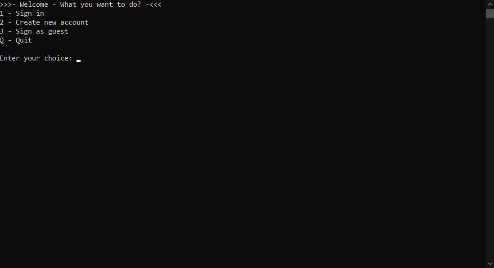

# **playvector** (v1.0)

This program is a playground with vector, create your own vector and implement the existing functions we have provided.

## **How to use?**

- ### **Access user**
    This is what you see when you run the program:

    

    Here you need to make your choice based on the options shown on the screen and enter the first letter of that option into **"Enter your choice"** line.

- ### **Try to calculate with it!**
    This is  it look like when you accessed:

    

    Now, create your own vector and try to calculate it with several options we already made. Enter the first letter of the option you chose into **"Enter your choice"** line.

## **Contact** 

If you have any troubles or bugs, please let me know at:
- **FB** :  [Luan Tang](https://www.facebook.com/luantang21/)
- **Email** : Luantang.work@gmail.com

